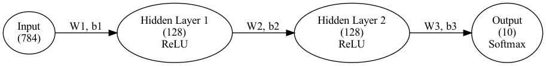
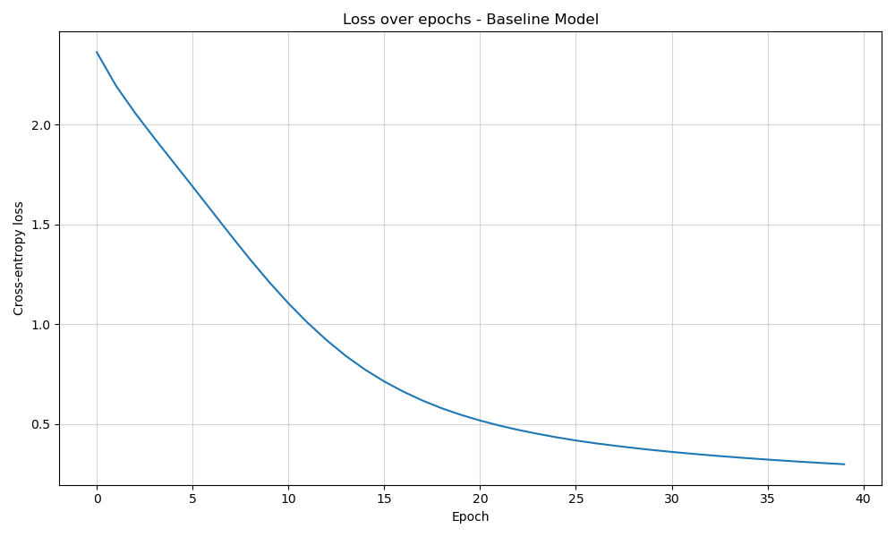
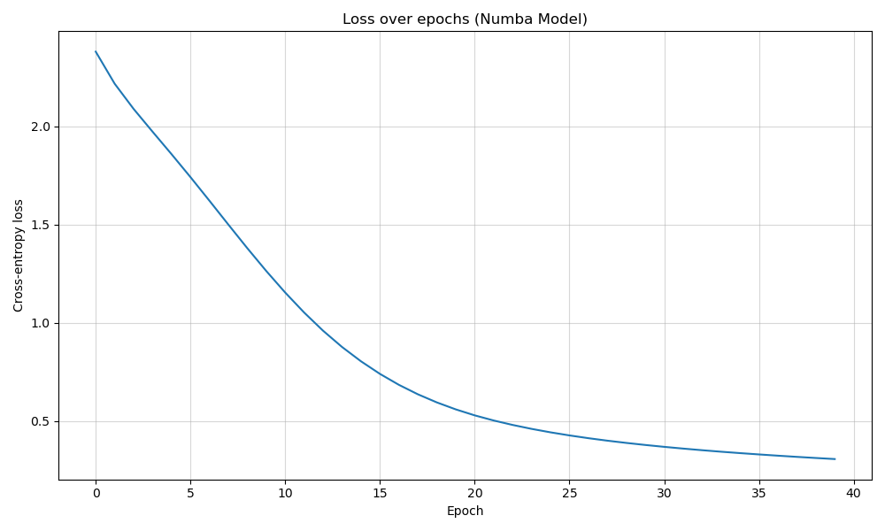
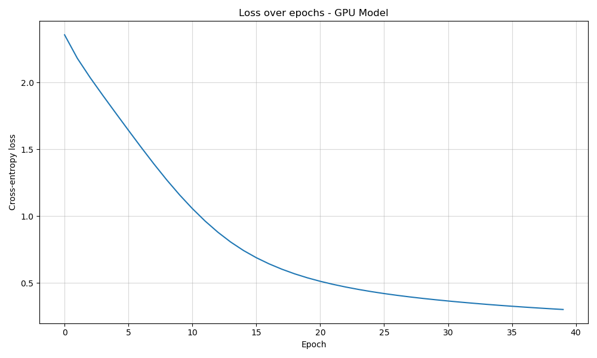

# Acceleration Multi-Layer Perceptron Training with Numba Optimization and Parallelization

*Anshul Srivastava*

#### Michigan State University

#### CMSE 401 Project

Table of Contents

[Abstract](#abstract)

[Methodology](#methodology)

[Timing Results](#timing-results)

[Table](#table-1)

[Concluding Discussion and Future Work](#concluding-discussion-and-future-work)

[References](#references)

## Abstract

This project delves into optimizing multi-layer perceptron (MLP) training within the deep learning domain by exploring various acceleration techniques. Our motivation stems from the educational interest in understanding how computation can be enhanced, especially for workloads that rely heavily on numerical operations. The baseline MLP, developed in NumPy, was chosen due to its inherent optimizations, making any further CPU-based speedup challenging. We experimented with two main strategies: just-in-time (JIT) compilation using Numba and GPU parallelization with CuPy. While JIT compilation introduced minor overheads leading to a slight slowdown, leveraging GPU capabilities with CuPy achieved over a 100x speed-up in training. Although these improvements are not groundbreaking, they offer valuable insights into the strengths and limitations of each approach, serving as an informative exploration of current techniques in high-performance deep learning computations.

## Methodology

### 1. Baseline Model

The starting point of our study was a multi-layer perceptron (MLP) implemented solely with NumPy. NumPy’s well-established, vectorized operations offer efficient, low-level performance for numerical computations, making it a common choice for baseline deep learning models (Zhang, 2020). Our baseline architecture is designed specifically for the MNIST dataset and comprises the following layers:

* **Input Layer:** 784 neurons corresponding to the 28×28 pixel images, with weights initialized using He initialization.
* **Hidden Layers:** Two hidden layers, each with 128 neurons and ReLU activation, to capture non-linear features effectively.
* **Output Layer:** 10 neurons with SoftMax activation to generate class probabilities for the digit categories.

This design serves as the control model to benchmark subsequent optimization attempts. Below is a diagram showing the MLP architecture.

### 2. Numba-Optimized MLP

In the second approach, we applied just-in-time (JIT) compilation through Numba to the core components of our MLP. Key functions—such as forward propagation, back propagation, activation, and loss calculation—were decorated using Numba’s NJIT decorator to enable machine-level optimization during runtime. Despite expectations of performance gains, the inherent overhead from JIT compilation led to a slight slowdown compared to the NumPy baseline (Numba Development Team, n.d.).

### 3. CuPy-Based MLP with GPU Parallelization

The third variant replaced NumPy with CuPy to exploit GPU parallelization, thereby capitalizing on the massive parallel processing capabilities of modern GPUs. This implementation yielded dramatic improvements, achieving over a 100x speed-up in training time compared to the CPU-bound baseline (CuPy Development Team, n.d.).

### Benchmarking Procedure

Each MLP model was trained on the standard MNIST dataset, retrieved via TensorFlow Datasets [Reference: TensorFlow Datasets]. The training used a configuration of 40 epochs with a learning rate of 0.001, where the training set comprised 60,000 samples of size 28×28. A dedicated Python script, benchmark.py, executed the training for each model five times. It computed and reported the average training time and test set accuracy. To ensure consistent experimental conditions, a Slurm script was developed to schedule the job on a high-performance computing cluster (HPCC) using 1 CPU task (ntasks = 1), 1 GPU (V100), and 3GB of memory. A new Conda environment was configured on the HPCC, and all required packages were installed, with full instructions provided in the README.

## Timing Results

After developing three different MLP variants—NumPy-based, Numba-JIT-compiled, and CuPy-accelerated—we conducted a series of experiments to quantify their performance in terms of both training time and model accuracy. Each model was trained on the MNIST dataset (60,000 images for training and 10,000 for testing) for 40 epochs and repeated five times to calculate average runtime and accuracy. Below is a summary of our key observations, drawn from the outfile logs and illustrated by the attached training loss plots.

### 1. Baseline MLP (NumPy)

* **Training Time:** The NumPy implementation required 37.22 seconds, a moderate amount of time on the CPU, benefitting from NumPy’s optimized vectorized operations.
* **Training Curve:** As seen in the plot (titled *Loss over epochs - Baseline Model*), the cross-entropy loss steadily decreased from above 2.0 down to roughly 0.4 by the 40th epoch, indicating stable convergence.
* **Accuracy:** The final test accuracy was consistent across runs (91.35%), demonstrating that a pure NumPy approach is both reliable and straightforward for small-to-medium-sized datasets.

### 2. Numba-JIT MLP

* **Training Time:** Contrary to initial expectations, decorating the core MLP routines (forward pass, backpropagation, activation, etc.) with Numba’s njit resulted in a slight slowdown on CPU (41.74 seconds). This likely stemmed from Numba’s compilation overhead and NumPy’s own optimizations already being quite efficient for this workload.
* **Training Curve:** As illustrated in the second plot (*Loss over epochs - Numba Model*), the training curve closely mirrored that of the baseline MLP, underscoring that the model’s convergence behavior remained virtually the same.
* **Accuracy:** Like the baseline, the Numba-optimized model maintained similar final accuracies (91.43%), reaffirming that the approach did not degrade predictive performance.

### 3. CuPy-Accelerated MLP

* **Training Time**: Leveraging GPU parallelization with CuPy produced the most significant reduction in runtime (0.35 seconds) —on the order of 100x faster than the CPU-bound models.
* **Training Curve:** As illustrated in the third plot (*Loss over epochs - GPU Model*), the training curve again closely mirrored that of the baseline MLP and Numba MLP, showing again that the convergence behavior remains the same.
* **Accuracy**: Despite the massive speed-up, the final accuracy was nearly identical to the other two variants (91.44%), indicating that parallelizing the core operations onto a GPU has no adverse effect on model quality for this MNIST task.

Overall, these results confirm that while Numba JIT compilation did not yield the anticipated speed-up over NumPy on a CPU-based system, utilizing CuPy on a GPU can deliver dramatic gains. The loss plots further illustrate that all three implementations converge similarly on MNIST, with final accuracies remaining close across the board.

## Table 1

Benchmarking Results

|  |  |  |
| --- | --- | --- |
| MLP Type | Training Time (seconds) | Test Accuracy (%) |
| Baseline - NumPy | 37.22 | 91.35 |
| Numba-JIT | 41.74 | 91.43 |
| CuPy - GPU | 0.35 | 91.44 |

## Concluding Discussion and Future Work

### Discussion
Our experiments illustrate the impressive optimization that NumPy already provides on the CPU. Despite the potential of CPU-based techniques like Numba’s JIT compilation, our observations indicate that these methods do not yield additional benefits when applied to an already optimized NumPy implementation—in fact, the slight slowdown likely reflects the overhead introduced by Numba. In contrast, leveraging GPU acceleration through CuPy resulted in a dramatic improvement, with training times reduced by more than 100x. This substantial speed-up underscores the importance of GPUs in deep learning training, supporting their status as the de facto standard for state-of-the-art neural network computations.

### Future Work
Looking ahead, we plan to investigate more creative strategies for enhancing both CPU and GPU performance. Potential avenues include implementing advanced batch-processing techniques to further streamline data throughput and exploring the optimization techniques employed by leading deep learning frameworks such as PyTorch and TensorFlow. Additionally, experimenting with mixed-precision training, asynchronous processing, and distributed computing architectures may yield further insights into accelerating model training while maintaining or improving model accuracy. These future endeavors aim to build on our current findings, potentially bridging the gap between educational explorations and state-of-the-art deep learning practices.

## References

*NumPy Model:*

    Zhang, S. [Samson Zhang]. (2020, November 24). *Building a neural network FROM SCRATCH (no Tensorflow/Pytorch, just numpy & math)* [Video]. YouTube. <https://www.youtube.com/watch?v=w8yWXqWQYmU&t=1320s/>

*Numba Model:*

    Numba Development Team. (n.d.). *Numba documentation*. Retrieved [March 27, 2025], from <https://numba.pydata.org/>

*CuPy Model:*

    CuPy Development Team. (n.d.). *CuPy documentation*. Retrieved [April 3, 2025], from <https://docs.cupy.dev/en/stable/>

    Corn, N. [nickcorn93]. (2021, July 21). *Tutorial: CUDA programming in Python with Numba and CuPy.* [Video]. YouTube <https://www.youtube.com/watch?v=9bBsvpg-Xlk&t=1054s/>